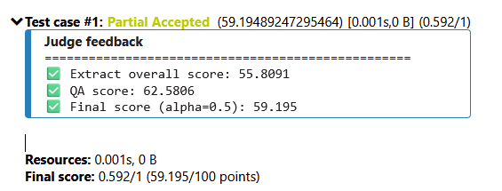

# RAG System for Multiple Choice Question Answering

RAG architecture for multiple choice question answering task - Inspired by [arxiv-paper-curator](https://github.com/jamwithai/arxiv-paper-curator).

## Performance
Achieved approximately 62.5% accuracy on the QA task using the Phase 4 private test set in Viettel AI Race 2025, ranked in the top 30.


## Quick Start

### Prerequisites
- Docker (with Docker Compose)
- Python 3.11+
- UV package manager: `curl -LsSf https://astral.sh/uv/install.sh | sh`
- 8GB+ RAM, 20GB+ disk space

### Setup

```bash
# 1. Navigate to project
cd test/rag_mcq_system

# 2. Copy environment config
cp .env.example .env

# 3. Install dependencies
uv sync

# 4. Start all services
docker compose up -d

# 5. Pull LLM model
docker exec rag-mcq-ollama ollama pull llama3.2:3b

# 6. Initialize database
uv run python -c "from src.db.session import init_db; init_db()"

# 7. Verify
make health
```

### Verify Installation

```bash
# Check all services
curl http://localhost:8000/health | python -m json.tool

# Expected: All services "healthy" or "ready"
```

## Architecture

```
PDF Files → Docling Parser → PostgreSQL → Section-Aware Chunker → Embeddings (Sentence Transformers)
                                                                           ↓
Question → FastAPI → Hybrid Search (OpenSearch: BM25 + Vector + RRF) → Ollama LLM → Answer
                           ↓
                     Redis Cache (optional)
```

## Key Components

| Component | Technology | Purpose |
|-----------|-----------|---------|
| **PDF Extraction** | Docling + GROBID | Structured content extraction |
| **Database** | PostgreSQL 16 | Document & chunk storage |
| **Search** | OpenSearch 2.11 | BM25 + Vector + Hybrid RRF |
| **Embeddings** | Sentence Transformers | Multilingual embeddings (768D) |
| **LLM** | Ollama (local) | Answer generation |
| **Cache** | Redis 7 | Response caching |
| **Orchestration** | Apache Airflow | Automated pipeline |
| **API** | FastAPI | REST endpoints |

## Usage

### 1. API Documentation
Open http://localhost:8000/docs for interactive Swagger UI

### 2. Search Documents

```bash
curl -X POST http://localhost:8000/api/v1/search \
  -H "Content-Type: application/json" \
  -d '{
    "query": "active learning trong medical imaging",
    "top_k": 5,
    "use_hybrid": true
  }'
```

### 3. Answer MCQ Question

```bash
curl -X POST http://localhost:8000/api/v1/ask \
  -H "Content-Type: application/json" \
  -d '{
    "question": "Công nghệ tương lai nào hứa hẹn tăng độ phân giải mô phỏng vũ trụ?",
    "options": {
      "A": "4G",
      "B": "Siêu máy tính exascale và máy tính lượng tử",
      "C": "Blockchain",
      "D": "Máy in 3D"
    },
    "top_k": 5,
    "use_hybrid": true
  }'
```

Expected response:
```json
{
  "question": "...",
  "predicted_option": "B",
  "answer_text": "...",
  "reasoning": "Dựa trên tài liệu...",
  "confidence": "high",
  "sources": [...],
  "timing": {
    "total_ms": 3500,
    "retrieval_ms": 150,
    "generation_ms": 3350
  }
}
```

## Data Pipeline (Airflow)

### Process PDFs

1. Copy PDFs to `../data/pdf/`
2. Trigger Airflow DAG:

```bash
# Via UI
open http://localhost:8080  # admin/admin

# Or CLI
docker exec rag-mcq-airflow airflow dags trigger pdf_ingestion_dag
```

3. Pipeline: `PDF → Parse → Chunk → Embed → Index to OpenSearch`
4. Monitor progress in Airflow UI

## Development

### Makefile Commands

```bash
make start          # Start all services
make stop           # Stop all services
make restart        # Restart services
make health         # Check service health
make logs           # View all logs
make logs-api       # View API logs
make test           # Run tests
make clean          # Clean Docker resources

# Database
make db-init        # Initialize database
make db-reset       # Reset database (WARNING: deletes data)

# Ollama
make pull-llama     # Pull Llama 3.2 3B
make pull-qwen      # Pull Qwen 2.5 7B
make list-models    # List available models
```

## Services & Ports

| Service | URL | Credentials |
|---------|-----|-------------|
| **API** | http://localhost:8000 | - |
| **API Docs** | http://localhost:8000/docs | - |
| **Airflow** | http://localhost:8080 | admin/admin |
| **OpenSearch** | http://localhost:9200 | admin/admin |
| **OpenSearch UI** | http://localhost:5601 | - |
| **PostgreSQL** | localhost:5432 | rag_user/rag_password |
| **Redis** | localhost:6379 | - |
| **Ollama** | http://localhost:11434 | - |

## Configuration

Edit `.env` file to customize:

```bash
# Embedding model
EMBEDDINGS_MODEL_NAME=sentence-transformers/paraphrase-multilingual-mpnet-base-v2

# Chunking config
CHUNKING_CHUNK_SIZE=600
CHUNKING_OVERLAP_SIZE=100

# Search config for opensearch
SEARCH_TOP_K_DEFAULT=5
SEARCH_USE_HYBRID_DEFAULT=true

# LLM (ollama model)
OLLAMA_MODEL=llama3.2:3b  # Change to qwen2.5:7b for better quality

# Cache config
REDIS_ENABLED=true
REDIS_CACHE_TTL_HOURS=24
```

## Troubleshooting

### Services not starting
```bash
make clean && make start
docker compose ps
docker compose logs -f
```

### OpenSearch connection failed
```bash
# Wait 30 seconds after start
sleep 30 && make health

# Check OpenSearch
curl http://localhost:9200/_cluster/health
```

### Ollama model not found
```bash
# List models
docker exec rag-mcq-ollama ollama list

# Pull model
docker exec rag-mcq-ollama ollama pull llama3.2:3b
```

### Database connection error
```bash
# Reset database
make db-reset
```

## Project Structure

```
src/
├── config.py                 # Configuration management
├── main.py                   # FastAPI application
├── models/
│   └── document.py          # SQLAlchemy models
├── schemas/
│   └── api.py               # Pydantic schemas
├── services/
│   ├── pdf_parser/          # Docling PDF parsing
│   ├── chunking/            # Section-aware chunking
│   ├── embeddings/          # Sentence Transformers
│   ├── opensearch/          # Hybrid search
│   ├── ollama/              # LLM client
│   ├── rag/                 # RAG pipeline
│   └── factories.py         # Service factories
├── routers/
│   ├── health.py            # Health checks
│   ├── search.py            # Search API
│   └── ask.py               # RAG Q&A API
└── db/
    └── session.py           # Database session

airflow/dags/
└── pdf_ingestion_dag.py     # PDF processing pipeline
```

## Features

### PDF Processing (Docling)
- Structured content extraction with GROBID and Docling
- Section detection and preservation
- Table extraction
- Metadata extraction

### Intelligent Chunking
- Section-aware strategy (600 words, 100 overlap)
- Smart handling of small/perfect/large sections
- Context header injection

### Hybrid Search
- **BM25**: Keyword matching for exact terms
- **Vector**: Semantic understanding with 768D embeddings
- **RRF Fusion**: Combines both for best results

### LLM Integration
- Local Ollama inference (privacy-first)
- Configurable models (llama3.2, qwen2.5, gemma2, etc.)
- Optimized prompts for MCQ answering
- Structured output parsing

### Production Features
- Redis caching (150-400x speedup)
- Comprehensive health checks
- Error handling & logging
- Airflow automation
- Scalable architecture

## Performance

| Metric | Expected Value |
|--------|-------|
| **Search Latency (BM25)** | ~50ms |
| **Search Latency (Hybrid)** | ~150ms |
| **LLM Response Time** | 3-20s (model dependent) |
| **Cache Hit Response** | ~50ms |
| **Expected Cache Hit Rate** | 60-70% |

## API Endpoints

### Health Check
- `GET /health` - Comprehensive health status
- `GET /ready` - Readiness check
- `GET /live` - Liveness check

### Search
- `POST /api/v1/search/` - Search documents (BM25/Hybrid)
- `GET /api/v1/search/health` - Search service health

### RAG Q&A
- `POST /api/v1/ask` - Answer single MCQ
- `POST /api/v1/ask/batch` - Answer multiple MCQs
- `GET /api/v1/models` - List available LLM models

## Environment Variables

See `.env.example` for all configuration options. Key variables:

- `POSTGRES_*` - Database configuration
- `OPENSEARCH_*` - Search engine settings
- `EMBEDDINGS_*` - Embedding model configuration
- `OLLAMA_*` - LLM settings
- `CHUNKING_*` - Chunking parameters
- `SEARCH_*` - Search defaults
- `REDIS_*` - Cache configuration

## References

- **GitHub**: [arxiv-paper-curator](https://github.com/jamwithai/arxiv-paper-curator)
- **Docling**: https://github.com/DS4SD/docling
- **OpenSearch**: https://opensearch.org/docs/latest/
- **Sentence Transformers**: https://www.sbert.net/
- **Ollama**: https://ollama.ai/